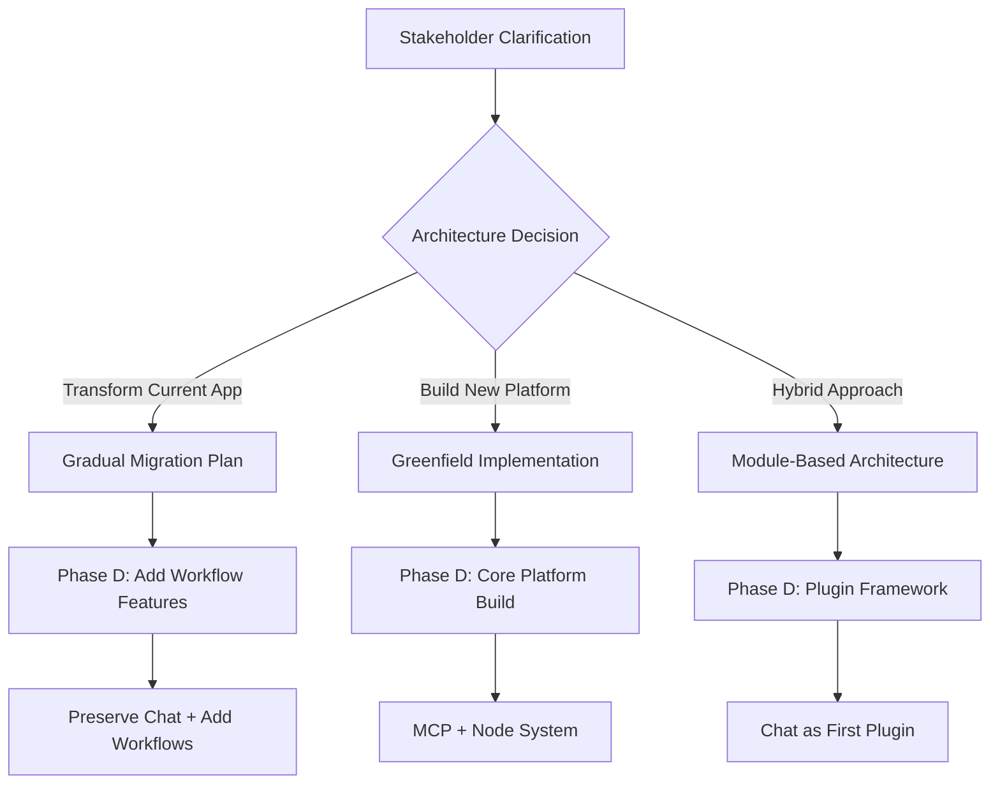

# Copilot Instructions - AI Prompt Coach

<!-- // CREATED_AUTOMATICALLY // VERIFY_OWNER_APPROVAL -->

## Repository Overview

This document provides GitHub Copilot with comprehensive context about the current repository state and architectural requirements for the Cartrita Unified Workflow Automation Platform Phase D implementation.

## Current Repository Architecture

### 🎯 **Current Implementation: Simple AI Chat Application**

**Backend (Node.js/Express - CommonJS)**
- **Runtime**: Node.js 18+ with Express.js framework
- **AI Integration**: Google Gemini 1.5-flash via `@google/generative-ai`
- **Database**: Google Cloud Firestore for chat persistence
- **API Structure**:
  - `POST /api/prompts` - Process user prompts and generate AI responses
  - `GET /api/history` - Retrieve chat history with pagination
- **Key Services**:
  - `services/gemini.js` - Gemini AI wrapper with configurable parameters
  - `lib/firestore.js` - Firestore connection and utilities
- **Configuration**: Environment-based (.env) with Google Cloud credentials

**Frontend (React + TypeScript + Vite)**
- **Framework**: React 19 with TypeScript in ESM
- **Build Tool**: Vite 7.x with HMR support
- **Styling**: Tailwind CSS 4.x with custom design system
- **State Management**: Zustand with persistence middleware
- **UI Components**: Custom components with Radix UI primitives
- **Key Features**:
  - Multi-conversation chat interface
  - Conversation starring and management
  - Real-time message streaming
  - Responsive design with sidebar navigation

**Infrastructure**
- **Deployment**: Google Cloud Build with Terraform IaC
- **Containerization**: Docker multi-stage builds
- **Environment**: Google Cloud Run for backend, static hosting for frontend

### 📊 **Current Capabilities**

✅ **Implemented Features**:
- AI prompt/response interface with Gemini integration
- Multi-conversation chat history with Firestore persistence
- TypeScript-first development with modern React patterns
- Responsive UI with conversation management
- Google Cloud deployment pipeline
- Environment-based configuration management

❌ **Missing Test Infrastructure**:
- No unit tests configured (app test script exits with error)
- No integration tests
- No E2E testing framework
- No CI/CD testing pipeline

## Master Prompt Expectations vs. Reality

### 🚨 **CRITICAL SCOPE CONFLICT IDENTIFIED**

The master implementation prompt requests **Phase D of a complex workflow automation platform** with the following expected capabilities:

#### Expected: Workflow Automation Platform
```yaml
Expected Architecture:
  - MCP (Model Context Protocol) integration
  - Plugin architecture and extensible node system
  - Workflow orchestration engine (n8n/Zapier parity)
  - Complex workflow builder interface
  - Multi-step automation pipelines
  - Integration marketplace
  - Advanced scheduling and triggers
  - Enterprise-grade scalability
```

#### Current: Simple AI Chat Application
```yaml
Actual Architecture:
  - Basic AI chat interface
  - Single AI model integration (Gemini)
  - Simple conversation persistence
  - No workflow capabilities
  - No plugin system
  - No orchestration engine
  - No automation features
```

### 🎯 **Technology Stack Analysis**

**Current Tech Stack** (Modern & Production-Ready):
- **Backend**: Node.js 18+ with Express (CommonJS for legacy compatibility)
- **Frontend**: React 19 + TypeScript + Vite 7 (Latest ESM standards)
- **Database**: Google Cloud Firestore (NoSQL, serverless)
- **AI**: Google Gemini 1.5-flash (Latest model)
- **Styling**: Tailwind CSS 4.x (Latest version)
- **State**: Zustand (Modern, lightweight alternative to Redux)
- **Build**: Vite (Fastest modern build tool)
- **Deployment**: Google Cloud (Enterprise-grade)

**Required for Workflow Platform**:
- MCP protocol implementation (New standard)
- Plugin architecture (Extensible system)
- Workflow engine (Complex orchestration)
- Node-based visual editor (Advanced UI)
- Integration APIs (Multiple service connections)
- Real-time collaboration (WebSocket/WebRTC)

## Zero-Length File Audit

✅ **Audit Completed**: No empty files found in the codebase. All source files contain proper implementation with appropriate content and structure.

## Resolution Requirements

### 🤔 **Critical Questions Requiring Stakeholder Clarification**

Before proceeding with Phase D implementation, the following must be resolved:

1. **Architectural Direction**
   - **Transform existing chat app** into workflow platform?
   - **Build workflow platform from scratch** alongside existing app?
   - **Replace existing functionality** entirely?

2. **Scope Confirmation**
   - Should current AI chat functionality be preserved?
   - Is the workflow platform the primary focus going forward?
   - What's the timeline for migration/transformation?

3. **Implementation Approach**
   - **Minimal changes**: Extend current architecture gradually?
   - **Complete system rebuild**: Start with workflow-first design?
   - **Hybrid approach**: Keep chat as one workflow node type?

4. **Technical Decisions**
   - Maintain current Google Cloud + Firestore stack?
   - Migrate to MCP-compatible infrastructure?
   - Keep current React frontend or build workflow editor?

### 📋 **Recommended Next Steps**



### 🚀 **Latest Tech Recommendations for Phase D**

If proceeding with workflow platform development:

**Core Technologies**:
- **Backend**: Node.js with Fastify (faster than Express) or Bun (latest runtime)
- **Real-time**: WebSocket with Socket.io or native WebRTC
- **Database**: PostgreSQL with Prisma ORM for complex workflow data
- **Caching**: Redis for workflow state management
- **Queue**: BullMQ for background job processing

**Workflow Engine**:
- **MCP Integration**: Official MCP SDK when available
- **Node System**: Custom React Flow-based editor
- **Plugin Architecture**: ES modules with sandboxed execution
- **API Gateway**: Fastify with OpenAPI 3.1 specification

**Frontend Enhancements**:
- **Workflow Editor**: React Flow + Monaco Editor for code nodes
- **State Management**: Zustand with workflow-specific stores
- **Real-time UI**: TanStack Query for server state + WebSocket integration
- **Design System**: Shadcn/ui with custom workflow components

---

<!-- // VERIFY_OWNER_APPROVAL: This document requires stakeholder review and architectural decision before Phase D implementation can proceed -->

*Generated automatically as part of Cartrita Unified Workflow Automation Platform Phase D prelude requirements.*